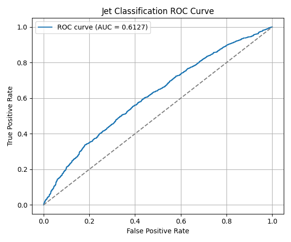
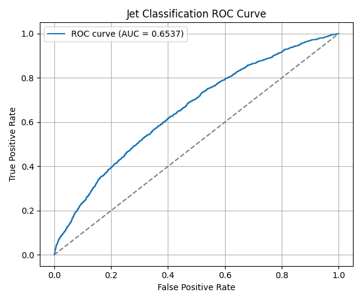

## Performance Discussion – Task 2: Jet Classification with Graphs

This task is classifying quark vs gluon jets using graph-based neural networks. The approach involved converting jet images to point clouds, building graphs, and training GNNs. Here's a breakdown of all the techniques I tried and what finally worked.

---

### Final Result
- **Best AUC**: `0.6537` using **EdgeConv** + **enhanced 14D node features**
- This confirmed the model learnt some structure in the jet graphs that helps distinguish between quark and gluon jets.

---

###  What I Tried

#### 1. Baseline GCN
- Started with a simple GCN:
  - Node features: `(x, y, channel, intensity)` → 4D
  - Edges: built using k-nearest neighbors (`k=10`)
- **Result**: AUC hovered around `~0.592`
- The model trained but hit a performance ceiling early.

#### 2. Feature Engineering - made it 7D
- To help the model learn better jet structure, I added:
  - Radial distance from jet center
  - Angle from jet center
  - Node degree
- Feature vector became: `x, y, c, intensity, r, angle, degree` → 7D
- For EdgeConv, feature vectors became 14D (`[x_i || x_j - x_i]`)
- This had a measurable impact when paired with a stronger model.

#### 3. Model Comparisons

| Model       | Notes                             | AUC     |
|-------------|-----------------------------------|---------|
| `GCN`       | Simple, worked as baseline        | ~0.612  |
| `GAT`       | Didn't help much, probably too noisy | ~0.61 |
| `GraphSAGE` | Performed similar to GCN          | ~0.61   |
| `EdgeConv`  | Best results with rich features   | **0.6537**  |

EdgeConv helped a lot because it directly captures local geometry — which aligns well with how energy is distributed across pixels in jets.

---

### Observations

- ROC curve showed that the model was learning — better than random by a clear margin.

- Loss and accuracy stayed flat early on in GCN/GAT runs, but improved when feature expressiveness was increased.
- Positional context and relative edge-based reasoning seemed key to improvements.

---

### 🧪 What Didn’t Work
- Just adding more layers to GCN/GAT didn’t help much
- Larger `k` (neighborhood size) beyond 10–15 degraded performance
- GraphSAGE underwhelmed — not ideal for sparse point clouds here
- Random guessing gives AUC ~0.5 — so we're better, but there's room to grow

---

### 🚀 Next Steps (if I continue this)

- Try learning edge features (like Euclidean distance, angle diff)
- Use hierarchical pooling or graph UNet
- Pretrain on synthetic data or other jet types
- Try JetNet-150 or point cloud datasets with physics-aware embeddings

---

This task taught me how crucial the **representation step** is before even thinking about what GNN architecture to use. When node features and edge construction matched the physical structure of jets better — performance followed.

