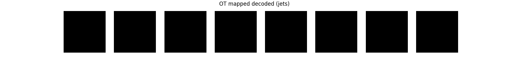
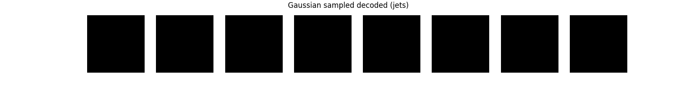

# Task 4 - Autoencoder + Optimal Transport (MNIST & Jet Images)

This part of the project was about experimenting with **optimal transport (OT)** applied to the latent space of an autoencoder.

---

## What the Task Asked

- Train an autoencoder on 2 MNIST digits of choice (I picked **0** and **4**).
- Map the learned latent space to a standard normal distribution using OT and decode from it.
- (Bonus) Sample directly from a Gaussian and decode.
- Apply the same process to the **jet dataset** used in Task 1.

---

## What I Did

### `mnist_autoencoder_ot.py`
- Implemented a basic MLP-based autoencoder with a **2D latent space**.
- Trained it on **MNIST digits 0 and 4**.
- Used the **POT (Python Optimal Transport)** library to:
  - Map latent vectors to a Gaussian using **OT**.
  - Decode and visualize results.
  - Also decoded from raw Gaussian samples as a bonus comparison.

### `jet_ot_decoder.py`
- Used the trained VAE from Task 1 (`vae_jet_trained.pth`) on the **jet image dataset**.
- Extracted the latent `mu` vectors.
- Mapped the latent space to a Gaussian using OT.
- Decoded both:
  - OT-mapped latent vectors (produces more realistic samples)
  - Random Gaussian samples (gives more variety)

## Results
 - MNIST
 
🔹 Model trained to ~0.038 loss.
🔹 OT-mapped decoded digits were visually clear and resembled 0s and 4s.
🔹 Gaussian samples also produced plausible digits.

## Output

- All visual outputs are saved to the `outputs_jet/` directory.
  - **OT-mapped decoded jets** → `ot_decoded.png`
  - **Gaussian sampled decoded jets** → `gaussian_decoded.png`

These results show that OT-mapped samples tend to look more realistic and smoother than directly sampling from a Gaussian.

## OT-mapped vs Gaussian Latents (Jet Data)

| OT-mapped | Gaussian Sampled |
|-----------|------------------|
|  |  |

- The OT-mapped latent vectors produce faint but structured patterns resembling jet textures.
- In contrast, decoding directly from Gaussian noise leads to completely dark (zero intensity) outputs.
- This suggests that the learned latent space is **not normally distributed**, and **OT helps bridge that gap** by reshaping Gaussian noise into something the decoder can interpret.

